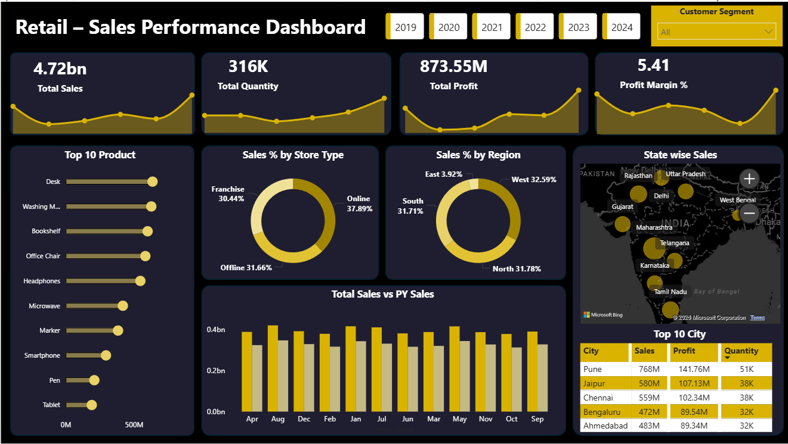
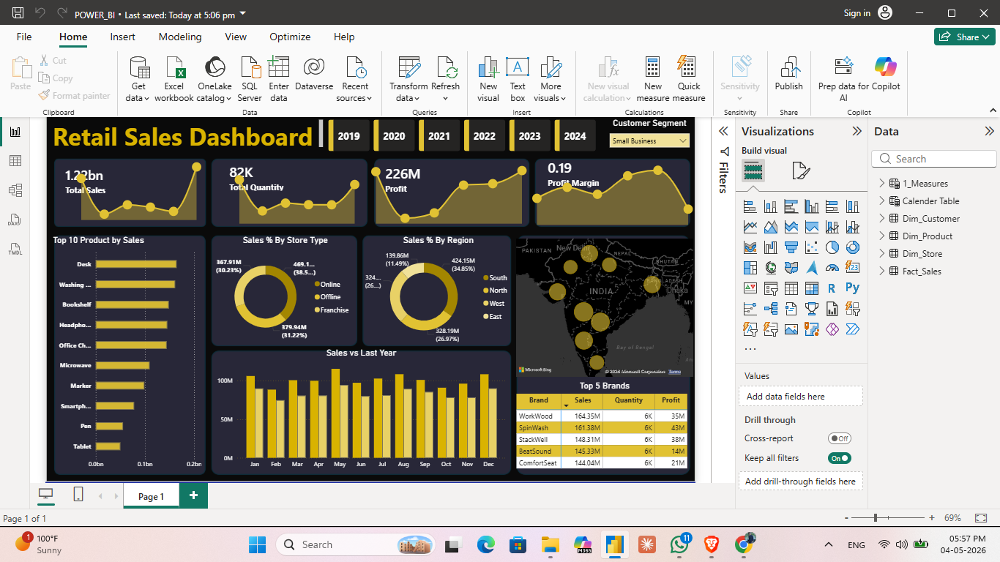

# 📊 Sales Data Analysis Dashboard

A comprehensive **Power BI Business Intelligence Project** designed to analyze retail sales performance, customer behavior, product trends, and store-level insights. This dashboard transforms raw data into actionable business intelligence to support data-driven decision-making.

## 🎯 Project Overview
The objective of this project is to analyze sales data from multiple business dimensions and present insights through an interactive Power BI dashboard.
Key focus areas:

* Sales Performance Analysis
* Customer Insights
* Product Performance
* Store Analysis
* Revenue Trends

## 📂 Dataset
The project uses multiple datasets:
| Dataset       | Description                    |
| ------------- | ------------------------------ |
| Sales.csv     | Transaction-level sales data   |
| Customer.xlsx | Customer information           |
| Product.csv   | Product details and categories |
| Store.xlsx    | Store and regional information |

## 🔗 Data Model
A Star Schema data model was created by establishing relationships between tables:
* Sales ↔ Customer (Customer ID)
* Sales ↔ Product (Product ID)
* Sales ↔ Store (Store ID)
This structure enables efficient reporting and analysis.
  
## 🛠️ Tools & Technologies
* Power BI
* Power Query
* DAX (Data Analysis Expressions)
* Excel
* CSV Data Sources

---

## ⚙️ Features

✔ Data Cleaning & Transformation using Power Query

✔ Data Modeling using Star Schema

✔ DAX Measures & KPIs

✔ Interactive Filters & Slicers

✔ Drill-Down Analysis

✔ Business Performance Tracking

## 📊 Dashboard Preview

## 📈 Key Insights
* 💰 Revenue and Sales Performance Trends
* 📊 Monthly and Yearly Growth Analysis
* 🏆 Top-Selling Products
* 👥 Customer Purchasing Behavior
* 🌍 Regional & Store-wise Performance
* 📅 Seasonal Sales Trends

## 📌 KPIs Tracked
* Total Revenue
* Total Sales
* Total Orders
* Average Order Value
* Customer Count
* Product Performance

## 🚀 Key Learnings
* Data Cleaning & Transformation
* Building Data Models
* Writing DAX Measures
* Dashboard Design Best Practices
* Business Intelligence Reporting

## 📥 How to Use
1. Download the `POWER_BI.pbix` file.
2. Open it using Power BI Desktop.
3. Refresh the data if required.
4. Explore the dashboard using filters and slicers.

## 🔮 Future Improvements
* Sales Forecasting
* Advanced DAX Calculations
* Customer Segmentation Analysis
* Enhanced Dashboard UI/UX

## 👨‍💻 Author
**Sagar Patil**
💼 LinkedIn: [www.linkedin.com/in/sagarpatil-data-analyst](http://www.linkedin.com/in/sagarpatil-data-analyst)
📧 Email: [sagarpatilsagar2002@gmail.com](mailto:sagarpatilsagar2002@gmail.com)

⭐ If you found this project helpful, consider giving it a star!
